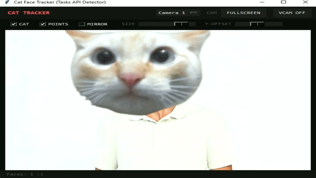

# Cat VTuber

Скрипт на Python, который в реальном времени отслеживает лицо через веб камеру и накладывает поверх него кота. Может выводить результат в виртуальную камеру для использования в Discord, Zoom, OBS и других программах.



## Возможности

* Улучшенное отслеживание лица через MediaPipe FaceDetection (BlazeFace). Отлично ловит лицо в профиль и под углом!
* Вывод в виртуальную камеру через pyvirtualcam
* Поддержка нескольких мониторов и изменение размера окна без зависаний
* Удобный интерфейс прямо в приложении: ползунки размера и смещения кота по высоте
* Темная и красивая UI панель
* Скрипт сам скачает нужную модель ИИ при первом запуске
* Многопоточная обработка камеры для устранения лагов

## Требования

* Python 3.9 или выше
* Веб камера
* OBS Studio (для создания виртуальной камеры)

## Установка

1. Склонируйте репозиторий:
```bash
git clone https://github.com/KreziBro/cat-vtuber.git
cd cat-vtuber
```

2. Установите зависимости:
```bash
pip install opencv-python mediapipe pillow numpy pyvirtualcam
```

3. Убедитесь, что в папке лежит файл cat.png (кот с прозрачным фоном).

## Запуск и использование

1. Запустите скрипт:
```bash
python cat.py
```
2. В интерфейсе скрипта нажмите на кнопку VCAM OFF, чтобы она переключилась на VCAM ON.
3. Зайдите в настройки видео в Discord (или Zoom) и выберите OBS Virtual Camera в качестве своей веб камеры.

## Стек

* Python
* OpenCV
* MediaPipe
* PyVirtualCam
